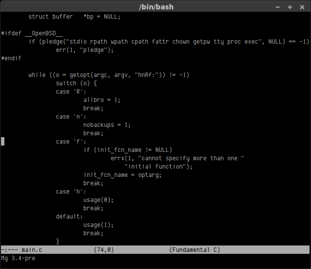

Micro Emacs
===========
[![License Badge][]][License] [![Travis Status][]][Travis] [![Coverity Status]][Coverity Scan]

Mg is a public domain [Micro Emacs][] derivative.  Created in 1986 and
based on the original MicroEMACS released by Dave Conroy in 1985.

The intention is to be a small, fast, and portable Emacs-like editor for
users who cannot, or do not want to, run the real Emacs for one reason
or another.  Compatibility with GNU Emacs is key for Mg, separating it
from other [ErsatzEmacs][] clones, because there should never be any
reason to learn more than one Emacs flavor.

Download the latest release, configure + make and you're done! =>
[Mg v3.3](https://github.com/troglobit/mg/releases/download/v3.3/mg-3.3.tar.gz)

The size constraints and target audience pose challenging limitations on
the feature set of Mg.  It is not scriptable or extensible like a true
Emacs, although a startup file is supported, and not all features are
available.

Feature patches are of course most welcome, as long as they remain in
the spirit of Mg -- to be small, fast, and portable.

Supported Platforms
-------------------

This project tracks the upstream OpenBSD Mg but also caters to other
sources of patches and new features.  It has been extensively tested on
Debian GNU/Linux, Ubuntu, CentOS, Fedora, Alpine Linux, FreeBSD, NetBSD,
OpenBSD, DragonFly BSD, Apple macOS >= 10.10, Cygwin, as well as a few
embedded Linux systems.

> **Note**: the official [portable Mg][] project, used by Debian and
> other GNU/Linux distributions, is maintained by Han Boetes.  Unlike
> this project, which is stand-alone, Boetes relies on [libbsd][] to
> maintain portability and follows the OpenBSD version very closely.

Building
--------

This project is almost completely self hosting, you only need a termcap
library, like ncurses, to provide the terminal APIs `setupterm()`,
`tgoto()`, and `tputs()`.

On recent Debian/Ubuntu based systems `libtinfo-dev` can be used, on
older ones the include file `term.h` is missing, so `libncurses-dev`
must be used instead:

    sudo apt install libtinfo-dev

or

    sudo apt install libncurses-dev

On other systems you have to install the full ncurses library instead,
on RHEL, CentOS, and Fedora:

    sudo yum install ncurses-devel

or

    sudo dnf install ncurses-devel

On macOS you need the Xcode command line toolls and headers.

    xcode-select --install

Then build Mg from the unpacked release tarball:

    ./configure
    make
    sudo make install

Users who checked out the source from GitHub must run `./autogen.sh`
first to create the configure script.  This requires GNU autotools to be
installed on the build system.

There are several options to the configure script to disable features,
e.g., to reduce the size, or remove features if you want to be on par
with the official Mg.  By default, all below features are enabled:

    ./configure --help
    [..]
    --disable-autoexec   Disable auto-execute support
    --disable-cmode      Disable C-mode support
    --disable-compile    Disable C compile & grep mode, used by C-mode
    --disable-cscope     Disable Cscope support
    --disable-ctags      Disable ctags(1) support, required by Cscope
    --disable-dired      Disable directory editor
    --disable-notab      Disable notab mode support (not in OpenBSD)
    --disable-regexp     Disable full regexp search
    --disable-togglenl   Disable toggle-newline-prompt extension (not in OpenBSD)
    --disable-all        Disable all optional features
    [..]
    --with-startup=FILE  Init file to run at startup if ~/.mg is missing

To build the smallest possible mg, with many features removed:

    ./configure --disable-all --enable-size-optimizations
    make
    sudo make install-strip

To build a completely static mg with all features:

    ./configure LDFLAGS="-static"
    make
    sudo make install-strip

History
-------

The history is long and intertwined with other MicroEMACS spin-offs but
goes something like this:

* Nov 16, 1986: First release to mod.sources
* Mar  3, 1987: First Release (mg1a) via comp.sources.unix
* May 26, 1988: Second release: (mg2a) via comp.sources.misc
* Jan 26, 1992: Linux port released by Charles Hedrick. This version
  later makes its way onto tsx-11, Infomagic, and various other Linux
  repositories.
* Feb 25, 2000: First import into the OpenBSD tree, where it is
  currently maintained with contributions from many others.
* May  8, 2016: First import from OpenBSD 5.9 to [GitHub][]
* May 15, 2016: First major release from GitHub
* Jul 22, 2018: Second major release from GitHub, now standalone!
* Aug 26, 2018: Third major release from GitHub, now portable!

See the source distribution for the list of [AUTHORS][].

Origin and References
---------------------

This project is derived from OpenBSD Mg, which is the best (maintained)
source of the original Micro Emacs based on mg2a.  The intention of this
project is to track all clones, and unlike the OpenBSD version, enable
its hidden features using a standard GNU configure script, while being
friendly to porting to resource constrained systems.

Merged, and continously tracked, clones:

- http://cvsweb.openbsd.org/cgi-bin/cvsweb/src/usr.bin/mg/ (upstream)
- https://github.com/hboetes/mg (official portable version)
- https://github.com/ibara/mg (active)
- https://github.com/scott-parker/mg-openbsd (inactive since 2015)
- https://github.com/paaguti/mg3a (continuation of Bengt Larsson's mg3a)
- https://github.com/kisom/kmg (another inactive fork with Go support)
- https://github.com/jasperla/tinyschemg (OpenBSD mg with tinyscheme)

Please report any bugs and problems with the packaging and porting to
the GitHub issue tracker <https://github.com/troglobit/mg/issues>

[Micro Emacs]:     https://www.emacswiki.org/emacs/MicroEmacs
[ErsatzEmacs]:     https://www.emacswiki.org/emacs/ErsatzEmacs
[portable Mg]:     https://github.com/hboetes/mg
[libbsd]:          https://libbsd.freedesktop.org/wiki/
[GitHub]:          https://github.com/troglobit/mg
[AUTHORS]:         https://github.com/troglobit/mg/blob/master/AUTHORS
[Joachim Nilsson]: http://troglobit.com
[License]:         http://unlicense.org/
[License Badge]:   https://img.shields.io/badge/license-Unlicense-blue.svg
[Travis]:          https://travis-ci.org/troglobit/mg
[Travis Status]:   https://travis-ci.org/troglobit/mg.png?branch=master
[Coverity Scan]:   https://scan.coverity.com/projects/8859
[Coverity Status]: https://scan.coverity.com/projects/8859/badge.svg
