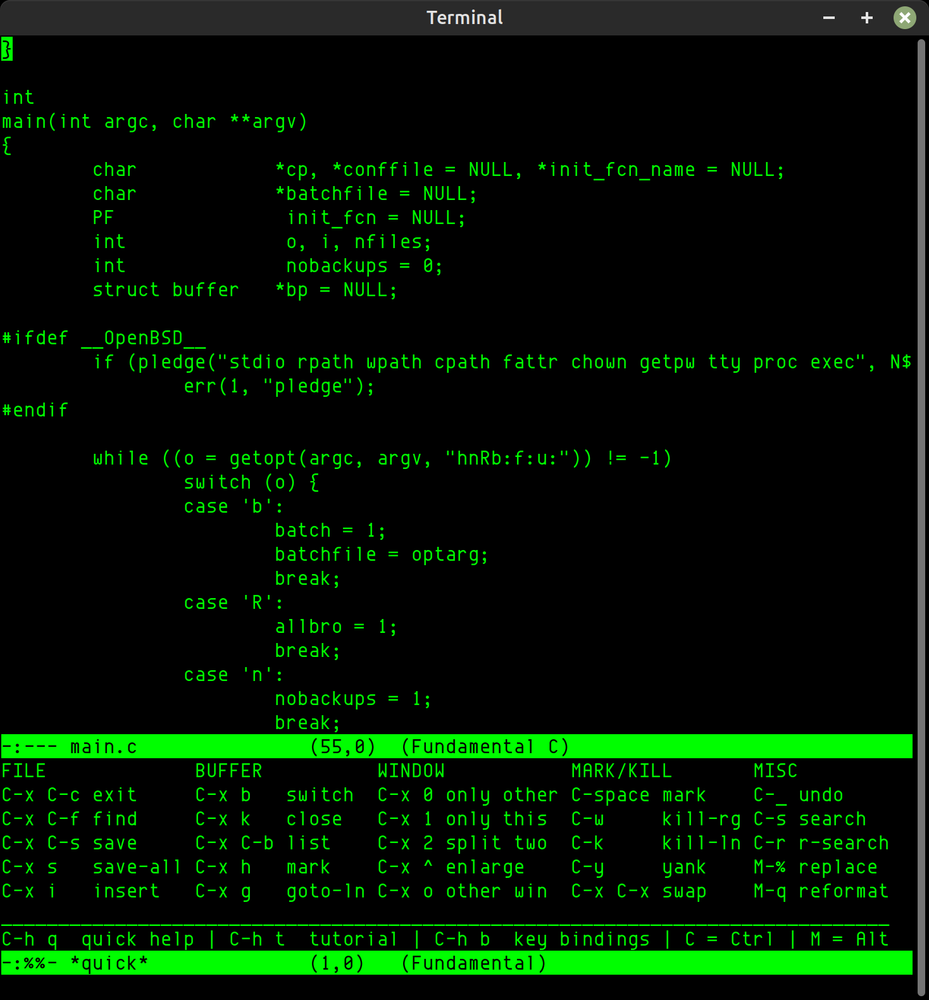

Micro (GNU) Emacs
=================
[![License Badge][]][License] [![GitHub Status][]][GitHub] [![Coverity Status]][Coverity Scan]

Contents
--------

* [Introduction](#introduction)
* [Usage](#usage)
* [Building](#building)
* [History](#history)
* [Origin & References](#origin--references)

Introduction
------------

Mg is a [Micro Emacs][] clone created in 1987, based on the original
[MicroEMACS][] v30 released by Dave Conroy in 1985.  The name, "Micro
GNU Emacs", was disputed early on by the FSF, so today it simply goes by
`mg`.  This software is fully free and in the public domain.

The intention is to be a small, fast, and portable Emacs-like editor for
users who cannot, or do not want to, run the real Emacs for one reason
or another.  Compatibility with GNU Emacs is key for Mg, separating it
from other [ErsatzEmacs][] clones, because there should never be any
reason to learn more than one Emacs flavor.

> Try the [latest release](https://github.com/troglobit/mg/releases/latest),
> use the tarball with a version in the name, avoid GitHub generated links!

Usage
-----

When Emacs was born keyboards had a `Meta` key.  Accessing functions
with `Meta` combinations today is usually the same as holding down the
`Alt` key, or tapping `Esc` once.

Other editors use short forms like `Ctrl-V` or `^V`, in Emacs this is
written `C-v`.  Some usage examples:

| **Key** | **Short** | **Example** | **Description**                       |
|---------|-----------|-------------|---------------------------------------|
| Meta    | M-        | M-x         | Hold down `Alt` and tap `x`           |
| Ctrl    | C-        | C-g         | Hold down `Ctrl` and tap `g`          |
| Ctrl    | C-        | C-x C-c     | Hold down `Ctrl` then tap `x` and `c` |

To access the built-in Quick Help, press `C-h q`, meaning: hold down
`Ctrl` and tap `h`, then release `Ctrl` and tap `q`.  The `-` has a
meaning, as you can see.

Building
--------

This project is completely self hosting.  However, by default you need a
termcap library, like [Ncurses][], to provide APIs like: `setupterm()`,
`tgoto()`, and `tputs()`.

See below for how to build without Ncurses.

### With termcap/terminfo/curses

On recent Debian/Ubuntu based systems `libtinfo-dev` can be used, on
older ones the include file `term.h` is missing, so `libncurses-dev`
must be used instead:

    sudo apt install libtinfo-dev

or

    sudo apt install libncurses-dev

On other systems you have to install the full Ncurses library instead,
on RHEL, CentOS, and Fedora:

    sudo yum install ncurses-devel

or

    sudo dnf install ncurses-devel

On macOS you need the Xcode command line tools and headers:

    xcode-select --install

Then build Mg from the unpacked release tarball:

    ./configure
    make
    sudo make install

### Without curses, completely stand-alone

    make clean
    ./configure --without-curses
	make
	sudo make install

### Building from GIT

Users who checked out the source from GitHub must run `./autogen.sh`
first to create the configure script.  This requires GNU autotools to be
installed on the build system.

There are several options to the configure script to disable features,
e.g., to reduce the size, or remove features if you want to be on par
with the official Mg.  By default, all below features are enabled:

    ./configure --help
    [..]
    --disable-autoexec   Disable auto-execute support
    --disable-cmode      Disable C-mode support
    --disable-compile    Disable C compile & grep mode, used by C-mode
    --disable-cscope     Disable Cscope support
    --disable-ctags      Disable ctags(1) support, required by Cscope
    --disable-dired      Disable directory editor
    --disable-notab      Disable notab mode support (not in OpenBSD)
    --disable-regexp     Disable full regexp search
    --disable-togglenl   Disable toggle-newline-prompt extension (not in OpenBSD)
    --disable-all        Disable all optional features
    [..]
    --with-startup=FILE  Init file to run at startup if ~/.mg is missing
    --with-mglog         Enable debugging to log file, default: ./log/*.log
    --without-curses     Build without curses/termcap, default: auto

To build the smallest possible mg, with many features removed:

    ./configure --disable-all --enable-size-optimizations
    make
    sudo make install-strip

To build a completely static mg with all features:

    ./configure LDFLAGS="-static"
    make
    sudo make install-strip

History
-------

The history is long and intertwined with other MicroEMACS spin-offs but
goes something like this:

* Nov 15, 1985: MicroEMACS v30 released to mod.sources by Dave G. Conroy
* Mar  3, 1987: First Release (mg1a) via comp.sources.unix
* May 26, 1988: Second release: (mg2a) via comp.sources.misc
* Jan 26, 1992: Linux port released by Charles Hedrick. This version
  later makes its way onto tsx-11, Infomagic, and various other Linux
  repositories.
* Feb 25, 2000: First import into the OpenBSD tree, where it is
  currently maintained with contributions from many others.
* May  8, 2016: Import from OpenBSD 5.9 to [GitHub][repo]
* May 15, 2016: Mg v3.0, first port back to Linux, by Joachim Wiberg
* Jul 22, 2018: Mg v3.1, removed libite dependency, by Joachim Wiberg
* Aug 26, 2018: Mg v3.2, now fully portable¹, by Joachim Wiberg
* Dec 11, 2019: Mg v3.3, misc fixes and new features from OpenBSD
* Aug 23, 2020: Mg v3.4, new modeline, quick-help, support for gzipped
  files, and building without termcap/[Ncurses][], by Joachim Wiberg
* Oct 17, 2021: Mg v3.5, support for Solaris/Illumos based UNIX systems
  tested on OmniOS and OpenIndiana, sync with Mg from OpenBSD 7.0

See the source distribution for the list of [AUTHORS][].

Origin & References
-------------------

This project is derived from OpenBSD Mg, which is the best (maintained)
source of the original Micro Emacs based on mg2a. The intention of this
project is to develop *new usability features*, track as many other Mg
clones as possible, and, unlike the upstream OpenBSD version, enable
hidden features using a standard GNU configure script, while remaining
friendly to porting to resource constrained systems.  New features:

* Emacs-like modeline with `(row,col)` and new `display-time-mode`
* Support for building without curses, using termios + escape seq.
* Built-in `*quick*` help using `C-h q`
* Tutorial accessible using `C-h t`
* Support for Ctrl-cursor + Ctrl-PgUp/PgDn like Emacs
* Support for `M-x no-tab-mode` and `M-x version`
* Support for opening gzipped text files in read-only mode

¹) This project has been extensively tested on Debian GNU/Linux, Ubuntu,
CentOS, Fedora, Alpine Linux, Solaris/Illumos based systems like OmniOS,
FreeBSD, NetBSD, OpenBSD, DragonFly BSD, Apple macOS >= 10.10, Cygwin,
MSYS2, as well as a few embedded Linux systems using musl libc and
uClibc-ng.

Merged, and continously tracked, clones:

* http://cvsweb.openbsd.org/cgi-bin/cvsweb/src/usr.bin/mg/ (upstream)
* https://github.com/hboetes/mg (official portable version)
* https://github.com/ibara/mg (active)
* https://github.com/scott-parker/mg-openbsd (inactive since 2015)
* https://github.com/paaguti/mg3a (continuation of Bengt Larsson's mg3a)
* https://github.com/kisom/kmg (another inactive fork with Go support)
* https://github.com/jasperla/tinyschemg (OpenBSD mg with tinyscheme)

> **Note**: the official [portable Mg][] project, used by Debian and
> other GNU/Linux distributions, is maintained by Han Boetes.  Unlike
> this project, which is stand-alone, Boetes relies on [libbsd][] to
> maintain portability.

Please report any bugs and problems with the packaging and porting to
the GitHub issue tracker <https://github.com/troglobit/mg/issues>

[Micro Emacs]:     https://www.emacswiki.org/emacs/MicroEmacs
[MicroEMACS]:      https://github.com/troglobit/MicroEMACS
[ErsatzEmacs]:     https://www.emacswiki.org/emacs/ErsatzEmacs
[portable Mg]:     https://github.com/hboetes/mg
[libbsd]:          https://libbsd.freedesktop.org/wiki/
[Ncurses]:         https://invisible-island.net/ncurses/
[repo]:            https://github.com/troglobit/mg
[AUTHORS]:         https://github.com/troglobit/mg/blob/master/doc/AUTHORS
[License]:         https://unlicense.org/
[License Badge]:   https://img.shields.io/badge/License-Unlicense-blue.svg
[GitHub]:          https://github.com/troglobit/mg/actions/workflows/build.yml/
[GitHub Status]:   https://github.com/troglobit/mg/actions/workflows/build.yml/badge.svg
[Coverity Scan]:   https://scan.coverity.com/projects/8859
[Coverity Status]: https://scan.coverity.com/projects/8859/badge.svg
