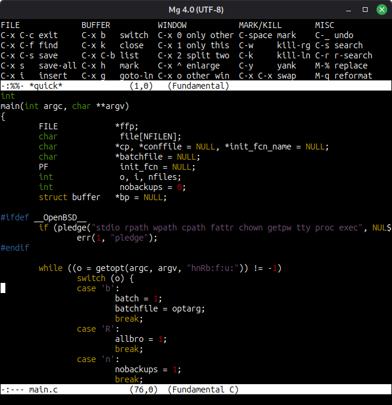

Micro (GNU) Emacs
=================
[![License Badge][]][License] [![Release Badge][]][Release] [![GitHub Status][]][GitHub] [![Coverity Status][]][Coverity Scan]

Contents
--------

* [Introduction](#introduction)
* [Usage](#usage)
* [Building](#building)
* [Docker](#docker)
* [History](#history)
* [Origin & Features](#origin--features)

Introduction
------------

Mg is a [Micro Emacs][] clone created in 1987, based on the original
[MicroEMACS][] v30 released by Dave Conroy in 1985.  The name, "Micro
GNU Emacs", was disputed early on by the FSF, so today it simply goes by
`mg`.  This software is fully free and in the public domain.

The intention is to be a small, fast, and portable Emacs-like editor for
users who cannot, or do not want to, run the real Emacs for one reason
or another.  Compatibility with GNU Emacs is key for Mg, separating it
from other [ErsatzEmacs][] clones, because there should never be any
reason to learn more than one Emacs flavor.

For a brief overview to what differs between [upstream][] OpenBSD Mg and what
features this project has added, [see below](#origin--features).

> [!TIP]
> Try the [latest release](https://github.com/troglobit/mg/releases/latest),
> use the tarball with a version in the name and a sha256 checksum next to it,
> avoid GitHub generated links!  Releases come with a `configure` script, so
> you don't need autotools.  Only a C compiler, `make` and you're set to go.

Usage
-----

When Emacs was born keyboards had a `Meta` key.  Accessing functions
with `Meta` combinations today is usually the same as holding down the
`Alt` key, or tapping `Esc` once.

Other editors use short forms like `Ctrl-V` or `^V`, in Emacs this is
written `C-v`.  Some usage examples:

| **Key** | **Short** | **Example** | **Description**                       |
|---------|-----------|-------------|---------------------------------------|
| Meta    | M-        | M-x         | Hold down `Alt` and tap `x`           |
| Ctrl    | C-        | C-g         | Hold down `Ctrl` and tap `g`          |
| Ctrl    | C-        | C-x C-c     | Hold down `Ctrl` then tap `x` and `c` |

To access the built-in Quick Help, press `C-h q`, meaning: hold down
`Ctrl` and tap `h`, then release `Ctrl` and tap `q`.  The `-` has a
meaning, as you can see.

Building
--------

This project is completely self hosting.  However, by default you need a
termcap library, like [Ncurses][], to provide APIs like: `setupterm()`,
`tgoto()`, and `tputs()`.

> [!TIP]
> See below for how to *build without Ncurses*.

### With termcap/terminfo/curses

On recent Debian/Ubuntu based systems `libtinfo-dev` can be used, on
older ones the include file `term.h` is missing, so `libncurses-dev`
must be used instead:

    sudo apt install libtinfo-dev

or

    sudo apt install libncurses-dev

On other systems you have to install the full Ncurses library instead,
on RHEL, CentOS, and Fedora:

    sudo yum install ncurses-devel

or

    sudo dnf install ncurses-devel

On macOS you need the Xcode command line tools and headers:

    xcode-select --install

Then build Mg from the unpacked release tarball:

    ./configure
    make
    sudo make install

### Without curses, completely stand-alone

    make clean
    ./configure --without-curses
	make
	sudo make install

### Building from GIT

Users who checked out the source from GitHub must run `./autogen.sh`
first to create the configure script.  This requires GNU autotools to be
installed on the build system.

There are several options to the configure script to disable features,
e.g., to reduce the size, or remove features if you want to be on par
with the official Mg.  By default, all below features are enabled:

    ./configure --help
    [..]
    --disable-autoexec   Disable auto-execute support
    --disable-cmode      Disable C-mode support
    --disable-compile    Disable C compile & grep mode, used by C-mode
    --disable-cscope     Disable Cscope support
    --disable-ctags      Disable ctags(1) support, required by Cscope
    --disable-dired      Disable directory editor
    --disable-notab      Disable notab mode support (not in OpenBSD)
    --disable-regexp     Disable full regexp search
    --disable-togglenl   Disable toggle-newline-prompt extension (not in OpenBSD)
    --disable-all        Disable all optional features
    [..]
    --with-startup=FILE  Init file to run at startup if ~/.mg is missing
    --with-mglog         Enable debugging to log file, default: ./log/*.log
    --without-curses     Build without curses/termcap, default: auto

To build the smallest possible mg, with many features removed:

    ./configure --disable-all --enable-size-optimizations
    make
    sudo make install-strip

To build a completely static mg with all features:

    ./configure LDFLAGS="-static"
    make
    sudo make install-strip

Docker
------

Alpine Linux based Docker container images are available from GitHub:

    docker pull ghcr.io/troglobit/mg:latest

To edit files from your host's `$HOME`, map it to the container's
`/root` and run:

    docker run -ti -v $HOME:/root ghcr.io/troglobit/mg:latest

This supports reading your `~/.mg` and it even takes arguments on the
command line.  Both quick help and the tutorial are bundled.

History
-------

The history is long and intertwined with other MicroEMACS spin-offs but
goes something like this:

* Nov 15, 1985: MicroEMACS v30 released to mod.sources by Dave G. Conroy
* Mar  3, 1987: First Release (mg1a) via comp.sources.unix
* May 26, 1988: Second release: ([mg2a][]) via comp.sources.misc
* Jan 26, 1992: Linux port released by Charles Hedrick. This version
  later makes its way onto tsx-11, Infomagic, and various other Linux
  repositories.
* Feb 25, 2000: First import into the OpenBSD tree, where it is
  currently maintained with contributions from many others.
* May  8, 2016: Import from OpenBSD 5.9 to [GitHub][repo]
* May 15, 2016: Mg v3.0, first port back to Linux, by Joachim Wiberg
* Jul 22, 2018: Mg v3.1, removed libite dependency, by Joachim Wiberg
* Aug 26, 2018: Mg v3.2, now fully portable[^1], by Joachim Wiberg
* Dec 11, 2019: Mg v3.3, misc fixes and new features from OpenBSD
* Aug 23, 2020: Mg v3.4, new modeline, quick-help, support for gzipped
  files, and building without termcap/[Ncurses][], by Joachim Wiberg
* Oct 17, 2021: Mg v3.5, support for Solaris/Illumos based UNIX systems
  tested on OmniOS and OpenIndiana, sync with Mg from OpenBSD 7.0
* Apr 10, 2023: Mg v3.6, sync with OpenBSD, improved ctags support
* Aug 13, 2023: Mg v3.7, sync with OpenBSD, improved usability
* Jul 10, 2026: Mg v4.0, initial UTF-8 support by Joachim Wiberg

See the source distribution for the list of [AUTHORS][].

[^1]: This project has been extensively tested on Debian GNU/Linux, Ubuntu,
      CentOS, Fedora, Alpine Linux, Solaris/Illumos based systems like OmniOS,
      FreeBSD, NetBSD, OpenBSD, DragonFly BSD, Apple macOS >= 10.10, Cygwin,
      MSYS2, as well as embedded Linux systems using musl libc and uClibc-ng.

Origin & Features
-----------------

This project is derived from, and tracks, [OpenBSD Mg][upstream], which is the
best (maintained) source of the original Micro Emacs based on [mg2a][].  The
intention of this project is to develop *new usability features* and remain
friendly to porting to resource constrained systems.

New features include, but are not limited to:

* UTF-8 support: multibyte characters can be typed, displayed, and edited
  in UTF-8 locales
* Syntax highlighting in buffers with a language mode, `c`, the new `python`
  `markdown`, and `shell-script` modes, toggled with `M-x font-lock-mode`
* Visual mark mode: the region between mark and dot is shown in reverse
  video, like transient-mark-mode in GNU Emacs
* Marking text with Shift + arrow keys
* Side by side windows with `C-x 3`, `split-window-horizontally`
* Window movement with `M-arrow keys` and resize with `M-S-arrow keys`
* Smart Tab indent in: `c`, `python`, and `shell-script` modes
* Emacs-like modeline with `(row,col)` and new `display-time-mode`
* Support for building without curses, using termios + escape seq.
* Support for exhuberant/universal ctags `tags` file format
* Built-in `*quick*` help using `C-h q`
* Tutorial accessible using `C-h t`
* Support for Ctrl-cursor + Ctrl-PgUp/PgDn like Emacs
* Support for `M-x no-tab-mode` and `M-x version`
* Support for opening gzipped text files in read-only mode

Please report any bugs and problems using the GitHub issue tracker
<https://github.com/troglobit/mg/issues>

[Micro Emacs]:     https://www.emacswiki.org/emacs/MicroEmacs
[MicroEMACS]:      https://github.com/troglobit/MicroEMACS
[ErsatzEmacs]:     https://www.emacswiki.org/emacs/ErsatzEmacs
[mg2a]:            https://texteditors.org/cgi-bin/wiki.pl?MG
[libbsd]:          https://libbsd.freedesktop.org/wiki/
[Ncurses]:         https://invisible-island.net/ncurses/
[upstream]:        http://cvsweb.openbsd.org/cgi-bin/cvsweb/src/usr.bin/mg/
[repo]:            https://github.com/troglobit/mg
[AUTHORS]:         https://github.com/troglobit/mg/blob/master/doc/AUTHORS
[License]:         https://unlicense.org/
[License Badge]:   https://img.shields.io/badge/License-Unlicense-blue.svg
[Release]:         https://github.com/troglobit/mg/releases
[Release Badge]:   https://img.shields.io/github/v/release/troglobit/mg
[GitHub]:          https://github.com/troglobit/mg/actions/workflows/build.yml/
[GitHub Status]:   https://github.com/troglobit/mg/actions/workflows/build.yml/badge.svg
[Coverity Scan]:   https://scan.coverity.com/projects/8859
[Coverity Status]: https://scan.coverity.com/projects/8859/badge.svg
